<div align="center">
  <!-- Sleek Dark Minimalist & Neon Cyberpunk Waving Header -->
  

  <!-- Typing SVG with Cyberpunk Glow -->
  <a href="https://sonusharma.com.np">
    
  </a>
</div>

<div align="center">
  <a href="https://sonusharma.com.np">
    
  </a>
  &nbsp;
  <a href="mailto:sonushar059@gmail.com">
    
  </a>
  &nbsp;
  <a href="https://github.com/SonuSharma2">
    
  </a>
  &nbsp;
  
</div>

<br/>

### 🌌 About Me

```typescript
interface DeveloperProfile {
  name: "Sonu Sharma";
  role: "Frontend Engineer & Creative Developer";
  education: "BSc (Hons) Computer Science @ Sunway International Business School";
  location: "Kathmandu, Nepal";
  coreFocus: [
    "Modern React & Next.js Scalable Architecture",
    "Type-Safe Web Applications (TypeScript)",
    "Interactive Experiences & Micro-Animations (GSAP, Framer Motion)",
    "High-Performance, Accessible & Responsive UI"
  ];
  superpower: "Strong QA & Automated Testing Foundation (Zero-Bug Mindset)";
  currentObsession: "Building fluid micro-interactions and high-impact web apps";
}
```

- 🎨 **Frontend Engineer & Creative Developer** specializing in modern, high-performance web applications built with **React**, **TypeScript**, and **Tailwind CSS**.
- ✨ **Interactive Motion & UI/UX**: Engineering immersive 60fps animations, spotlight masking, dynamic marquees, and responsive micro-interactions using **GSAP** and modern CSS.
- 🛡️ **Zero-Regression Mindset**: Backed by strong experience in **QA & Test Automation** (**Playwright**, **Selenium**, **Pytest**), ensuring rock-solid stability and testability across web frontends.
- 🚀 **Featured Platforms**: [Interactive Superhero Portfolio](https://sonusharma.com.np) & [SauceDemo E2E Test Suite](https://github.com/SonuSharma2/SauceDemo-Automation).

---

<!-- ======================================================== -->
<!-- DYNAMIC CYBERPUNK TERMINAL & CONTRIBUTION SECTION -->
<!-- ======================================================== -->
<div align="center">
  <table border="0" cellspacing="0" cellpadding="0" style="border: none; border-collapse: collapse; background: transparent;">
    <tr>
      <td width="50%" align="center" valign="top" style="border: none; padding: 6px;">
        
      </td>
      <td width="50%" align="center" valign="top" style="border: none; padding: 6px;">
        
      </td>
    </tr>
  </table>
  <br/>
  
</div>
<!-- ======================================================== -->

---

### 🛠️ Tech Stack & Tooling

<div align="center">

| Domain | Technologies & Frameworks |
| :--- | :--- |
| **Frontend & Creative UI** |  |
| **Motion & Design Systems** |  &nbsp; `GSAP Animations` &nbsp; `Framer Motion` &nbsp; `Micro-Interactions` |
| **Testing & Quality Assurance** |  &nbsp; `Playwright` &nbsp; `Pytest` &nbsp; `Page Object Model (POM)` |
| **DevOps, Tools & Cloud** |  |

</div>

---

### 📊 Telemetry & GitHub Analytics

<div align="center">
  
  &nbsp;
  
</div>

<div align="center">
  
</div>

---

### 🐍 Contribution Activity Snake

<div align="center">
  <picture>
    <source media="(prefers-color-scheme: dark)" srcset="https://raw.githubusercontent.com/SonuSharma2/SonuSharma2/output/github-contribution-grid-snake-dark.svg">
    <source media="(prefers-color-scheme: light)" srcset="https://raw.githubusercontent.com/SonuSharma2/SonuSharma2/output/github-contribution-grid-snake.svg">
    
  </picture>
</div>

---

### 🚀 Featured Projects

<table>
  <tr>
    <td width="50%" style="background-color: #030712;">
      <h3 align="center">🌐 <a href="https://github.com/SonuSharma2/Portfolio">Interactive Superhero Portfolio</a></h3>
      <p align="center">
        Modern high-performance web portfolio featuring custom cursor spotlight masking, dynamic 3D marquees, and GSAP scroll animations.
      </p>
      <p align="center">
        
      </p>
      <p align="center">
        <b>Live:</b> <a href="https://sonusharma.com.np">sonusharma.com.np</a>
      </p>
    </td>
    <td width="50%" style="background-color: #030712;">
      <h3 align="center">🧪 <a href="https://github.com/SonuSharma2/SauceDemo-Automation">SauceDemo E-Commerce QA</a></h3>
      <p align="center">
        Comprehensive end-to-end test automation framework built on Page Object Model (POM) pattern for continuous test execution.
      </p>
      <p align="center">
        
      </p>
      <p align="center">
        <b>Stack:</b> <code>Selenium</code> • <code>Pytest</code> • <code>POM</code>
      </p>
    </td>
  </tr>
  <tr>
    <td width="50%" style="background-color: #030712;">
      <h3 align="center">🔒 <a href="https://github.com/SonuSharma2/ImageSteganography">Image Steganography System</a></h3>
      <p align="center">
        Python Flask and Pillow web platform that embeds and decodes confidential text within image pixels via Least Significant Bit (LSB) algorithms.
      </p>
      <p align="center">
        
      </p>
      <p align="center">
        <b>Algorithm:</b> <code>LSB Cryptography</code> • <code>Pillow</code>
      </p>
    </td>
    <td width="50%" style="background-color: #030712;">
      <h3 align="center">🎮 <a href="https://github.com/SonuSharma2/tictactoe">Tic-Tac-Toe Console Engine</a></h3>
      <p align="center">
        Classic 2-player console game engineered in pure C with dynamic grid buffer rendering and real-time win/draw detection logic.
      </p>
      <p align="center">
        
      </p>
      <p align="center">
        <b>Platform:</b> <code>Pure C</code> • <code>Windows CLI</code>
      </p>
    </td>
  </tr>
</table>

---

<div align="center">
  <!-- Neon Gradient Footer -->
  
</div>
